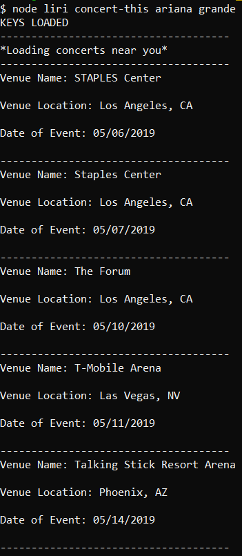
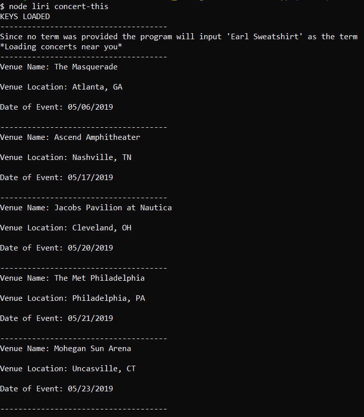
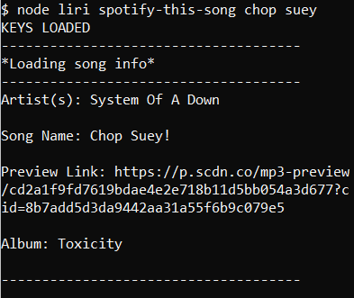
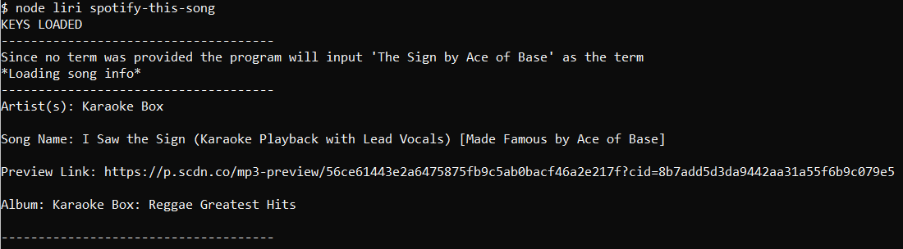
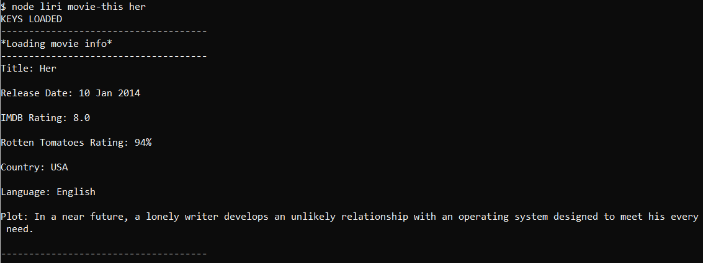
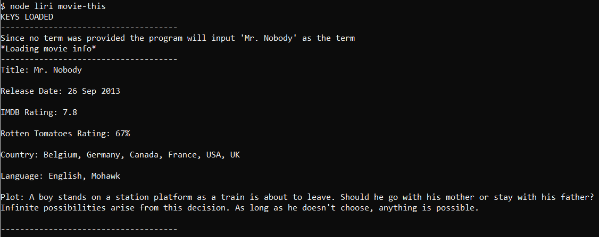
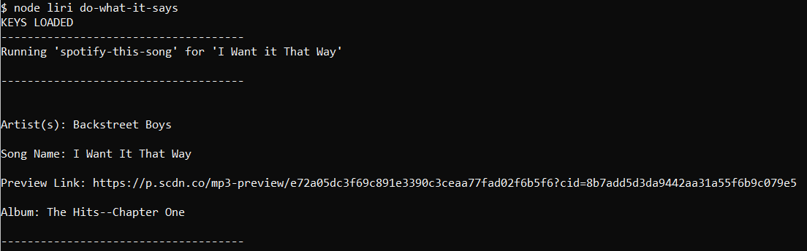

# liri-node-app

LIRI is a CLI App which takes in 4 possible parameters and gives the user back data.

## The Liri app uses:

* [node-spotify-api](https://www.npmjs.com/package/node-spotify-api)
* [Axios](https://www.npmjs.com/package/axios)
    * [OMDb API](http://www.omdbapi.com/)
    * [bandsintown API](http://www.artists.bandsintown.com/bandsintown-api)
* [moment](https://www.npmjs.com/package/moment)
* [dotenv](https://www.npmjs.com/package/dotenv)

**Axios** will be needed to send requests and retrieve data.

LIRI searches the node-spotify-api for song info, bandsintown API for concert info, and OMDb for movie info.

## How to use LIRI:

If you want to clone and run this app yourself, you will have to supply your own **.env** file for it to work. To learn more about about dotenv [click here!](https://www.npmjs.com/package/dotenv)

To use Liri you must open the directory in which liri.js is located in the command line. 

Then then choose one of the four possible paremters.

# 4 Parameters:

* concert-this
* spotify-this-song
* movie-this
* do-what-it-says

You type into the command line for example **node liri spotify-this-song** then provide a term for this command, pick a song, lets say Graduation by Kanye West. Which will look like this **node liri spotify-this-song graduation** after just presss enter.

You should see this in the command line

That's the basics of it!
I will now go into more detail on each command.

## concert-this

Type **node liri concert-this** then an artist's name for an example i'll use 'Ariana Grande'.

This would look like **node liri concert-this ariana grande**

You will see information about 5 different venues. It will display the venue's name, location and the date of the event using [Axios](https://www.npmjs.com/package/axios) with the [bandsintown API](http://www.artists.bandsintown.com/bandsintown-api) and [moment](https://www.npmjs.com/package/moment) to format the date.

If the user does not provide a term and leaves it as **node liri concert-this** the program will default to a preset term which is set to 'Earl Sweatshirt' and then display the 5 venues information for that term.

## spotify-this-song

Type **node liri spotify-this-song** then a song's name for an exmple i'll use 'Chop Suey' by System of A Down.

This would look like **node liri spotify-this-song chop suey**

The command will display the artist of the song, the song name, a preview link and the album the song was on using the [node-spotify-api](https://www.npmjs.com/package/node-spotify-api).

If the user does not provide a term and leaves it as **node liri spotify-this-song** the program will default to a preset term which is set to 'The Sing by Ace of Base' and then display the information about that term.

## movie-this

Type **node liri movie-this** then a movie name for an example i'll use 'Her'.

This would like like **node liri movie-this her**

The command will display information about the movie such as the title, release date, IMDB rating, Rotten Tomatoes rating, country in which the movie was produced, language and a short summary. This command uses [Axios](https://www.npmjs.com/package/axios) with the [OMDb API](http://www.omdbapi.com/).

If the user does not provide a term and leaves it as **node liri movie-this** the program will default to a preset term which is set to 'Mr. Robot' and then display the movie's information.

## do-what-it-says

Type **node liri do-what-it-says**

Unlike the other commands, **do-what-it-says** does not take in a term.

This command will read the content inside the [random.txt](./random.txt) file which is **"spotify-this-song,"I Want it That Way""**. It will take will the **spotify-this-song** command and use **I Want it That Way** from the random.txt file as term.

It should look like this:

