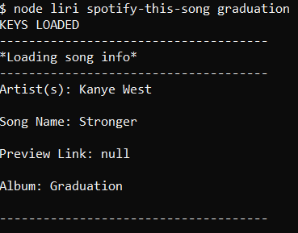

# liri-node-app

Liri is a CLI App which takes in 4 possible parameters and gives the user back data.

To use Liri you must open the directory in which liri.js is located in the command line. 
Then then choose one of the four possible paremters.

### 4 Parameters

-concert-this
-spotify-this-song
-movie-this
-do-what-it-says

You type into the command line for example **node liri spotify-this-song** then provide a term for this command, pick a song, lets say Graduation by Kanye West. Which will look like this **node liri spotify-this-song graduation** after just presss enter.

You should see this in the command line
